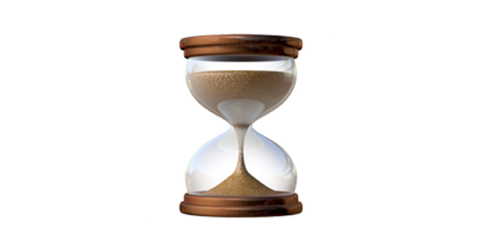

# Code Execution Timer
- 👋 Hi, I’m @WilliamSpanfelner
- 👀 I’m interested in using Python with Swift in iOS environments and why it may or may not be desirable.
- 🌱 I’m currently learning more Python with the London App Brewery and Angela Yu's [100 Days of Code: 
The Complete Python Pro Bootcamp for 2022](https://www.udemy.com/course/100-days-of-code/) on Udemy.  

- 🧑‍💻 This Python project illustrates a use case for decorator functions.  Specifically, this code will time the execution of two different functions and report the results for comparison.

- 💞️ I’m looking to collaborate on application development.
- 📫 How to reach me ... Twitter: @WSpanfelner

